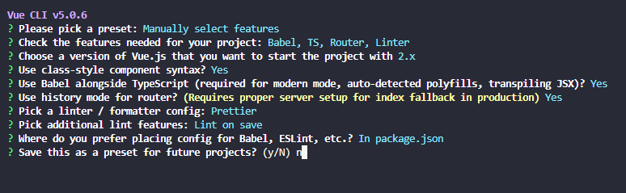

# Fullstack? Why not (Django + Vue-js)

<style>
    r { color: Red }
    g { color: Green }
    b { color: Blue }
    Orange { color: Orange }
    LightGreen { color: LightGreen }
    Cyan { color: Cyan }
    LightPink { color: LightPink }
</style>

## Table of Contents
1. [Django side](#django)
2. [Vue.js side](#vuejs)

## <Cyan>Implement episode 1</Cyan> 
<hr>

<h2 id="django"><LightGreen>Django side</LightGreen></h2>
<hr>
- Create a new Django project

`python manage.py startproject {project}`

- Start the server with

`python manage.py runserver`

- Add application

`python manage.py startapp {app}`

- Migrate database

`python manage.py migrate`

### <g>Change settings before run server</g>

* Change the `{django-project-dir}\{django-project-name}\settings.py`

```python
INSTALLED_APPS = [
    'django.contrib.admin',
    'django.contrib.auth',
    'django.contrib.contenttypes',
    'django.contrib.sessions',
    'django.contrib.messages',
    'django.contrib.staticfiles',
    'shark',
    'corsheaders',
]

CORS_ORIGIN_ALLOW_ALL = True

MIDDLEWARE = [
    'django.middleware.security.SecurityMiddleware',
    'django.contrib.sessions.middleware.SessionMiddleware',
    'django.middleware.common.CommonMiddleware',
    'django.middleware.csrf.CsrfViewMiddleware',
    'django.contrib.auth.middleware.AuthenticationMiddleware',
    'django.contrib.messages.middleware.MessageMiddleware',
    'django.middleware.clickjacking.XFrameOptionsMiddleware',
    'corsheaders.middleware.CorsMiddleware',
]
```
`shark` is an application that I added with startapp

```python
'corsheaders'  
CORS_ORIGIN_ALLOW_ALL = True  
'corsheaders.middleware.CorsMiddleware',
```
These three line is used for the CORS purpose (Just think that it enabled CORS which allow you pass API between server-client)

* Database settings  
Using `sqlite3`
```python
DATABASES = {
    'default': {
        'ENGINE': 'django.db.backends.sqlite3',
        'NAME': BASE_DIR / 'db.sqlite3',
    }
}
```
or `Oracle`
```python
DATABASES = {
    'default': {
        'ENGINE': 'django.db.backends.oracle',
        'NAME': 'localhost:1521/XEPDB1',
        'USER': 'django',
        'PASSWORD': 'django',
    }
}
```
or `Mysql`
```python
DATABASES = {
    'default': {
        'ENGINE': 'django.db.backends.mysql',
        'NAME': 'polling',
        'HOST': 'localhost',
        'USER': 'djangouser',
        'PASSWORD': 'djangopassword',
        
        'OPTIONS': {
            'sql_mode': 'traditional',
        }
    }
}
```
These 3 are patterns I have used in my testing projects.

Run `python manage.py migrate` to apply these changes


<h2 id="vuejs"><LightPink>Vue.js side</LightPink></h2>
<hr>

```
vue create testfrontend
```
`testfrontend` is my frontend project




- Start the frontend with

```shell
$cd testfrontend
$npm run serve
```

