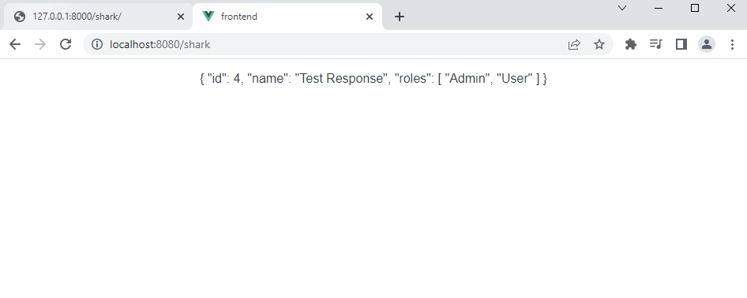
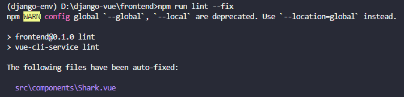

# Fullstack? Why not (Django + Vue-js)

<style>
    r { color: Red }
    g { color: Green }
    b { color: Blue }
    Orange { color: Orange }
    LightGreen { color: LightGreen }
    Cyan { color: Cyan }
    LightPink { color: LightPink }
</style>

## Table of Contents
1. [Django side](#django)
2. [Vue.js side](#vuejs)

## <Cyan>Implement episode 2</Cyan>
<hr>

<h2 id="django"><LightGreen>Django side</LightGreen></h2>
<hr>

`{projectname}/urls.py`
```python
from django.contrib import admin
from django.urls import include, path

urlpatterns = [
    path('admin/', admin.site.urls),
    path('shark/', include('shark.urls')),
]
```
`shark/urls.py`
```python
from django.urls import path
from . import views

app_name = 'shark'
urlpatterns = [
    # path('', views.IndexView.as_view(), name='index'),
    path('', views.index, name='index'),
]
```

`shark/views.py`
```python
from urllib import response
from django.shortcuts import render
from django.views import generic
from django.http import HttpResponse
from .models import mShark
from django.http import JsonResponse

def index(request):
    responseData = {
        'id': 4,
        'name': 'Test Response',
        'roles' : ['Admin','User']
    }

    return JsonResponse(responseData)
    # return HttpResponse("return this string")

# Create your views here.
# class IndexView(generic.ListView):
#     # template_name = 'shark/index.html'
#     model = mShark

#     def get_queryset(self):
#         return mShark.getIntro(self)
#         # return HttpResponse("return this string")
```
`shark/models.py`
```python
from django.db import models

# Create your models here.
class mShark(models.Model):
    intro = "Hello, This is Shark from Django"

    def getIntro(self) -> set[str]:
        return { mShark.intro }
```

<h2 id="vuejs"><LightPink>Vue.js side</LightPink></h2>
<hr>

`frontend/src/router/index.js` or `.ts`
```ts
import Vue from "vue";
import VueRouter from "vue-router";
import Shark from "../components/Shark.vue";

Vue.use(VueRouter);

const routes = [
  {
    path: "/shark",
    name: "Shark",
    component: Shark,
  },
];

const router = new VueRouter({
  mode: "history",
  base: process.env.BASE_URL,
  routes,
});

export default router;

```

* Create new file `frontend/src/components/Shark.vue`

```ts
<template>
  <div>
    <p>{{ msg }}</p>
  </div>
</template>

<script>
import axios from "axios";

export default {
  name: "vShark",
  data() {
    return {
      msg: "",
    };
  },
  methods: {
    getResponse() {
      const path = "http://127.0.0.1:8000/shark/";
      axios
        .get(path)
        .then((res) => {
          console.log(res.data);
          this.msg = res.data;
        })
        .catch((err) => {
          console.log(err);
        });
    },
  },
  created() {
    this.getResponse();
  },
};
</script>

```

Now everytime we go to path `http://localhost:8080/shark` which is frontend side

Vue will ask the server at `http://127.0.0.1:8000/shark/` and get the response
Then print all the messages in the frontend web page



## Additional commands:
* Run `npm run lint --fix` to fix linting errors (recommend setting `Prettier` extension when using VSCode)

